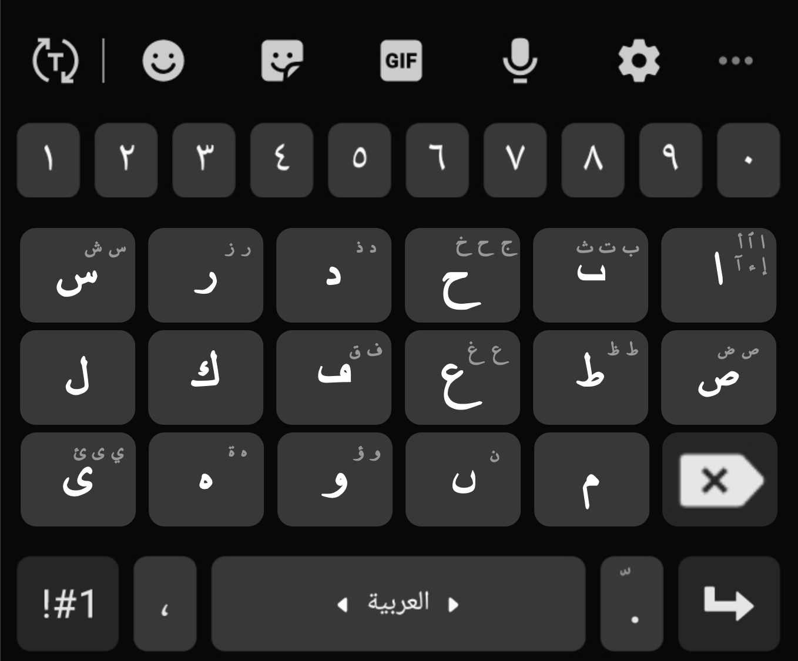

**بسم الله الرحمـــــــــــن الرحيم**
# dotless
**Repository for the "Dotless" AI-powered mobile keyboard for the Arabic script.**

*Summary:*
"Dotless" is a vision for a mobile keyboard app for the Arabic script which reduces the number of keys by using AI to differentiate between similar letters (e.g. ج،ح،خ) based on context, thereby drastically simplifying the layout and making it easier for users to type.

## Overview
The original Arabic script did not use dots to differentiate between letters. For example, ج،ح،خ were all written as ح. However, the Arabs at the time of the Prophet ﷺ were masters of the language to such an extent that they could figure out which letter it was based only on the context. If humans could do this 1400 years ago, why can’t AI do the same thing? Currently, the Arabic script has 29 letters, and mobile touchscreen keyboards have to incorporate all of them, which makes typing complicated and relatively difficult. However, if only symbols without dots are used, and an AI engine automatically places dots based on context etc. then only 17 symbols require keyboard buttons (a reduction of 12 buttons) which dramatically simplifies the keyboard and thus makes typing easier. Even though it may take some time to adjust to the new keyboard, humans naturally crave ease and it is expected that they would gravitate towards this idea.

## Goal
- Develop and deploy a simplified mobile keyboard app for the Arabic script without dots which uses AI to place dots on letters.

## Specifications
Technical specifications will be refined as we move on with the project In Shaa Allah, but for now:
- App Dev: Android Studio
- AI Engine: Google Cloud Platform AI tools
- Programming Languages: Kotlin/Java and Python

## Milestones
1. **Idea:** Through “Design Thinking”, produce a mockup and validate the concept.
2. **Planning:** As part of the SCRUM methodology, set up Jira and Confluence and make a backlog w/ user stories, decide who’s doing what.
3. **Develop:** Select the Architecture and relevant technologies, learn required skills, and develop the Android App.
4. **Test:** Test the App.
5. **Deploy:** Put App on Google Play for the whole world to access.
6. **iOS:** Using lessons learned, make a version for iOS devices as well
7. **Other languages:** Update capabilities for other languages that also use the Arabic script such as Urdu, Persian, Kurdish, etc.

*Ideally we can have the first version on Google Play by the end of the Spring Semester 2024 In Shaa Allah.*
